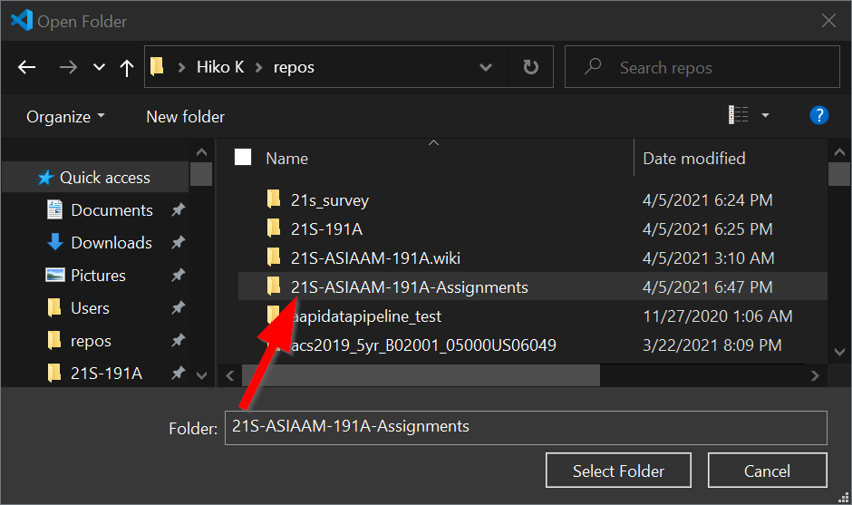

# Lab 2: Hello World (of HTML, Javascript, CSS, and Leaflet mapping!)


>### Lab Objectives:
> - Create a basic webpage 
> - Add a Leaflet map
> - Add data to the map

## Let's get VS Coding!
Start up VS Code and open your Assignments repo:


Remember to select the correct folder!


1. Make sure Explorer is open in the activity bar by clicking on it:


1. Click on `Week_02` <span style="background-color:red">**(1)**</span> and then the `new file` button <span style="background-color:red">**(2)**</span>:
   
   
## HTML?! Oh what `tag`gony!
Recall from the MDN reading that HTML is what makes up webpages and how they talk to the server. Everything in HTML is surrounded by tags which look like this:
`<tag> Look Ma'! I'm in a tag! </tag>`

### Attributes in tags
If we can only use tags, the web would be a pretty boring place. So in order to make each tag unique, we can add attributes to them. To do so, you add an `attribute="some value"`

For example, we can name a tag something:
`<tag name="Albert"></tag>`

Wow, that's my name tag!

We will start with a basic html structure and go from there:

```html
<!DOCTYPE html>
<html>
    <head>
        <title>Hello World with Leaflet</title>
        <meta charset="utf-8" />
        <!-- I'd add some style if here if I had any -->
    </head>

    <body>

        <header>
            Hello World!
        </header>
    
        <div class="sidebar">
My Sidebar
        </div>

        <div id="content">
                    My Map
        </div>

    </body>
</html>
```

> What do you observe in the code? 
> 1. Why should everything be enclosed in the `html` tag?
> 2. Do empty spaces matter in HTML?
> 3. What is a comment and how do you write one?
> 4. What is the difference between the `class` and `id` attributes?

To answer these, let's save the file and name it `index.html` and open it in Firefox.

Hint: Right click on your `index.html` file and `reveal in file explorer`. Then, double click on the file.


## Cool Stylin' Sheets
Recall that HTML is like the house, and now we want to decorate it, so we will add some Cascading Style Sheets (CSS):

Insert the following code in the head right before the closing tag (`</head>`):

```html
<style>
    html {
        background-color: azure
    }
</style>
```
What happened to the page?

That's cool and all, but style sheet's can get quite long, so when coding we usually have a seperate file for it and bring it in as a linked source.

Copy the following CSS and save it as `style.css` in a new folder called `css`:

```
html, body {
    padding: 5px;
 }

 body {
     display: grid;
     grid-template-rows: .1fr .90fr .05fr;
     grid-template-columns: 1fr;
     grid-template-areas: "header" "main" "footer";
 }

 header {
    grid-area: header;
    display: grid;
    grid-template-columns: .2fr .6fr .2fr;
    justify-content: center;
 }

.sidebar {
    grid-area: sidebar;
    background-color: #555;
}
.content {
    grid-area: content;
}
```

